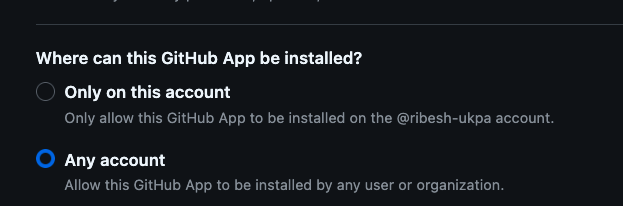

# Jenkins CI/CD with GitHub App — Automatic Build on Push

This guide covers setting up automatic Jenkins builds triggered by GitHub pushes using a GitHub App, with Multibranch Pipeline or GitHub Organization Folder. Security is considered at every step.

---

## Architecture Overview

```
Developer (git push)
    → GitHub Repository (GitHub App installed)
        → Webhook (HTTPS, SHA-256 signed)
            → Jenkins (Multibranch Pipeline / Org Folder)
                → Pipeline Build (Jenkinsfile)
                    → Build status reported back to GitHub
```

---

## Prerequisites

Before starting, ensure you have:

- Jenkins 2.387 or newer
- The following Jenkins plugins installed:
  - **GitHub Branch Source**
  - **GitHub App**
  - **Credentials Binding**
  - **Pipeline**
  - **Multibranch Scan Webhook Trigger** *(for Multibranch Pipeline webhook triggering)*
- A GitHub account with admin access to the target org or repository
- Jenkins accessible from the internet via HTTPS (e.g. `https://jenkins.yourdomain.com`)

---

## Step 1 — Create a GitHub App

1. Go to **GitHub → Settings → Developer settings → GitHub Apps → New GitHub App**

2. Fill in the following fields:

   - **GitHub App name**: e.g. `jenkins-ci-yourcompany`
   - **Homepage URL**: your Jenkins URL (e.g. `https://jenkins.rentalbux.com`)
   - **Webhook URL**: `https://jenkins.rentalbux.com/github-webhook/`
   - **Webhook secret**: generate a strong random secret and save it:
     ```bash
     openssl rand -hex 32
     ```

3. Set **Permissions** — grant only what Jenkins needs (principle of least privilege):

   |No.| Permission | Level |
   |---|---|---|
   |1.|Repository → Administration| Read-only|
   |2.|Repository → Checks |Read & Write|
   |3.|Repository → Commit statuses | Read & Write |
   |4.|Repository → Contents | Read & Write|
   |5.|Repository → Deployments| Read & Write|
   |6.|Repository → Metadata (Mandatory)| Read-only    |
   |7.|Repository → Pull requests| Read-only|
   |8.|Repository → Webhooks | Read & Write |
   |9.|Organization → Administration| Read-only|
   |10.| Organization → Members | Read-only|

4. Subscribe to **Events**:
   - Check run
   - Check suite
   - Pull request
   - Push
   - Repository
   - Workflow run

5. (IMPORTANT): Where can this GitHub App be installed?
    -    Select **Any account** for Github Organization level access. ✅
    -    Select **Only on this account for personal repos**
    

6. Click **Create GitHub App**

7. Note the **App ID** shown on the app settings page

8. Scroll down and click **"Generate a private key"** — download the `.pem` file immediately and store it securely

---

## Step 2 — Install the GitHub App on Your Repo or Org

1. Go to your **GitHub App → Install App**
2. Choose your **organization** or specific **repositories**
3. Avoid "All repositories" unless required — scope it only to what Jenkins builds

> **Security note**: Installing on specific repos limits blast radius if the App credential is ever compromised.

---

## Step 3 — Add Credentials to Jenkins

### 3a — Convert the Private Key to PKCS#8

Jenkins requires the private key in PKCS#8 format:

```bash
openssl pkcs8 -topk8 -inform PEM -outform PEM \
  -in downloaded-key.pem -out jenkins-key.pem -nocrypt
```

### 3b — Add the GitHub App Credential

Go to **Manage Jenkins → Credentials → System → Global credentials → Add Credentials**:

- **Kind**: GitHub App
- **App ID**: *(the number from your GitHub App settings)*
- **Private Key**: paste the contents of `jenkins-key.pem`
- **ID**: `github-app-credential`

Click **Verify** — you should see:
```
GHApp verified, remaining rate limit: XXXX
```

### 3c — Add the Webhook Secret

Add a second credential:

- **Kind**: Secret text
- **Secret**: the webhook secret generated in Step 1
- **ID**: `webhook-secret`

> **Security note**: Never commit `.pem` files or secrets to source control. Store them only in Jenkins' encrypted credential store.

---

## Step 4 — Configure Jenkins to Validate Webhooks

1. Go to **Manage Jenkins → Configure System → GitHub section**
2. Click **Advanced**
3. Under **Shared secrets**, add the `webhook-secret` credential created in Step 3c
4. Set **Signature algorithm** to `SHA-256 (Recommended)` — never use SHA-1

This ensures Jenkins validates the `X-Hub-Signature-256` header on every incoming webhook, rejecting forged or replayed requests.

---

## Step 5 — Install the Multibranch Scan Webhook Trigger Plugin

This plugin is required to allow webhook events to trigger Multibranch Pipeline scans and builds automatically.

1. Go to **Manage Jenkins → Plugins → Available plugins**
2. Search for:
   ```
   Multibranch Scan Webhook Trigger
   ```
3. Check the box → click **Install**
4. Restart Jenkins after installation

---

## Step 6 — Create a Multibranch Pipeline Job

### For a Single Repository

1. **New Item → Multibranch Pipeline**

2. Under **Branch Sources → Add source → GitHub**:
   - **Credentials**: select `github-app-credential`
   - **Repository HTTPS URL**: `https://github.com/your-username/your-repo`
   - **Behaviors**: add:
     - Discover branches
     - Discover pull requests from forks *(set trust to "Contributors" or stricter — never "Everyone")*
     - Filter by name *(optional — to limit which branches build)*

3. Under **Scan Repository Triggers**:
   - Check **"Scan by webhook"**
   - **Trigger token**: set a unique token, e.g. `your-repo-webhook-token`

4. Keep **"Periodically if not otherwise run"** checked with interval `1 day` as a safety net

5. Click **Save**

---

## Step 7 — Update the Webhook URL in Your GitHub App

Now that the plugin is installed and the token is set, update the webhook URL in your GitHub App:

Go to **GitHub App settings → General → Webhook URL** and change it to:

```
https://jenkins.yourdomain.com/multibranch-webhook-trigger/invoke?token=your-repo-webhook-token
```

> The token must exactly match what you set in Step 6.

---

## Step 8 — Add a Jenkinsfile to Each Repository

Jenkins discovers and runs pipelines defined in a `Jenkinsfile` at the **root** of the repository. Without this file, Jenkins will receive the webhook but silently skip building.

```groovy
pipeline {
    agent any

    options {
        timeout(time: 30, unit: 'MINUTES')
        disableConcurrentBuilds()
        buildDiscarder(logRotator(numToKeepStr: '10'))
    }

    stages {
        stage('Checkout') {
            steps {
                checkout scm
            }
        }

        stage('Build') {
            steps {
                sh 'npm install'
            }
        }

        stage('Test') {
            steps {
                sh 'npm test'
            }
        }
    }

    post {
        success {
            githubSetCommitStatus context: 'ci/jenkins', status: 'SUCCESS'
        }
        failure {
            githubSetCommitStatus context: 'ci/jenkins', status: 'FAILURE'
        }
    }
}
```

> **Important**: The file must be named exactly `Jenkinsfile` — capital J, no file extension — at the repo root.

---

## Step 9 — Verify the Setup

1. Push a commit to any branch in your repository
2. Go to GitHub App settings → **Advanced → Recent Deliveries** — you should see:
   - A `push` event delivery
   - Response code `200`
3. Open your Multibranch Pipeline in Jenkins — a new build should appear within seconds
4. Check the **GitHub Checks tab** on the commit in GitHub — Jenkins should report build status back

### Testing Webhook Delivery Manually

You can also click **Redeliver** on any past delivery in GitHub App → Advanced → Recent Deliveries to re-send the webhook without making a new push.

---

## Troubleshooting

### Webhook is delivered (200) but no build triggers

This was the most common issue encountered. Causes and fixes:

| Symptom | Cause | Fix |
|---|---|---|
| GitHub shows 200 but no build | "Scan by webhook" not enabled | Install Multibranch Scan Webhook Trigger plugin and enable it |
| Branch visible in Jenkins but never rebuilds | Webhook URL still pointing to `/github-webhook/` | Update to `/multibranch-webhook-trigger/invoke?token=TOKEN` |
| Branches not discovered at all | Jenkinsfile missing from branch | Add `Jenkinsfile` to the root of the branch |
| 403 response from Jenkins | Webhook secret mismatch | Verify secret in GitHub App matches Jenkins credential |
| 404 response from Jenkins | Wrong webhook URL | Check URL has correct domain and trailing slash |
| 302 response from Jenkins | Missing trailing slash | Add `/` at the end of the webhook URL |

### Enable Debug Logging in Jenkins

Go to **Manage Jenkins → System Log → Add new log recorder**:

- **Name**: `webhook-debug`
- **Logger**: `com.cloudbees.jenkins.GitHubWebHook`
- **Level**: ALL

Push a commit and immediately check this log for detailed webhook processing output.

### Run a Manual Scan

If builds aren't triggering, open your Multibranch Pipeline → click **"Scan Multibranch Pipeline Now"** → then click **"Scan Multibranch Pipeline Log"** to see exactly which branches were found and why any were skipped.

---

## Security Hardening Checklist

### Jenkins

- Run Jenkins behind a reverse proxy (nginx/Caddy) with HTTPS — never expose port 8080 directly
- Enable **CSRF protection** in Manage Jenkins → Security
- Use **Matrix-based security** or **Role Strategy Plugin** — never leave authorization as "Anyone can do anything"
- Use Jenkins' encrypted credential store — never inject secrets as plain environment variables in Jenkinsfile
- Rotate the GitHub App private key and webhook secret periodically

### GitHub App Permissions

- Never grant `Administration` or `Secrets` permissions to the Jenkins GitHub App
- For fork PRs, set trust level to **"Contributors"** or stricter — never "Everyone" as this allows arbitrary code execution on your agents
- Scope the app installation to specific repositories, not all repositories

### Network

- Allowlist GitHub's webhook IP ranges in your firewall — the current ranges are listed at `https://api.github.com/meta` under the `hooks` key
- Verify Jenkins is reachable from GitHub:
  ```bash
  curl -I https://jenkins.yourdomain.com/multibranch-webhook-trigger/invoke?token=your-token
  # Should return 200 or 405 — both mean Jenkins received it
  ```

---

## GitHub Organization Folder Setup

If you want Jenkins to automatically discover and build **all repositories** in a GitHub organization:

### Webhook URL for Org Folder

With Organization Folder, the **GitHub Branch Source plugin handles webhook routing natively** — no extra plugin needed. Use the standard webhook URL:

```
https://jenkins.yourdomain.com/github-webhook/
```

### Enable "Manage Hooks"

Go to **Manage Jenkins → Configure System → GitHub → GitHub Servers** and ensure:

- A GitHub Server entry exists with your `github-app-credential`
- **"Manage hooks"** is checked ✅

Jenkins will then auto-register webhooks on every repo in your org automatically.

### Create the Org Folder Job

1. **New Item → GitHub Organization**
2. Under **Projects → GitHub Organization**:
   - **Credentials**: `github-app-credential`
   - **Owner**: your GitHub org name
   - **Repository Filter**: use a regex to limit which repos are scanned, e.g. `(backend|frontend|api)-.*`

---

## Webhook URL Summary

| Job Type | Plugin Required | Webhook URL |
|---|---|---|
| Multibranch Pipeline | Multibranch Scan Webhook Trigger | `https://jenkins.yourdomain.com/multibranch-webhook-trigger/invoke?token=TOKEN` |
| Organization Folder | GitHub Branch Source (built-in) | `https://jenkins.yourdomain.com/github-webhook/` |
| Freestyle Job | GitHub plugin | `https://jenkins.yourdomain.com/github-webhook/` |

---

## Summary of Key Points

- The GitHub App uses **JWT-based authentication** — no personal access tokens stored in Jenkins
- Always use **SHA-256** for webhook signature validation, never SHA-1
- A `Jenkinsfile` must exist at the **root of every branch** you want Jenkins to build
- The **Multibranch Scan Webhook Trigger** plugin is required for Multibranch Pipelines to react to webhooks in real time
- For Organization Folders, the GitHub Branch Source plugin handles everything natively with "Manage hooks" enabled
- Scope GitHub App installation to **specific repos** rather than all repositories
- Never set fork PR trust to **"Everyone"** — this is a critical security risk
